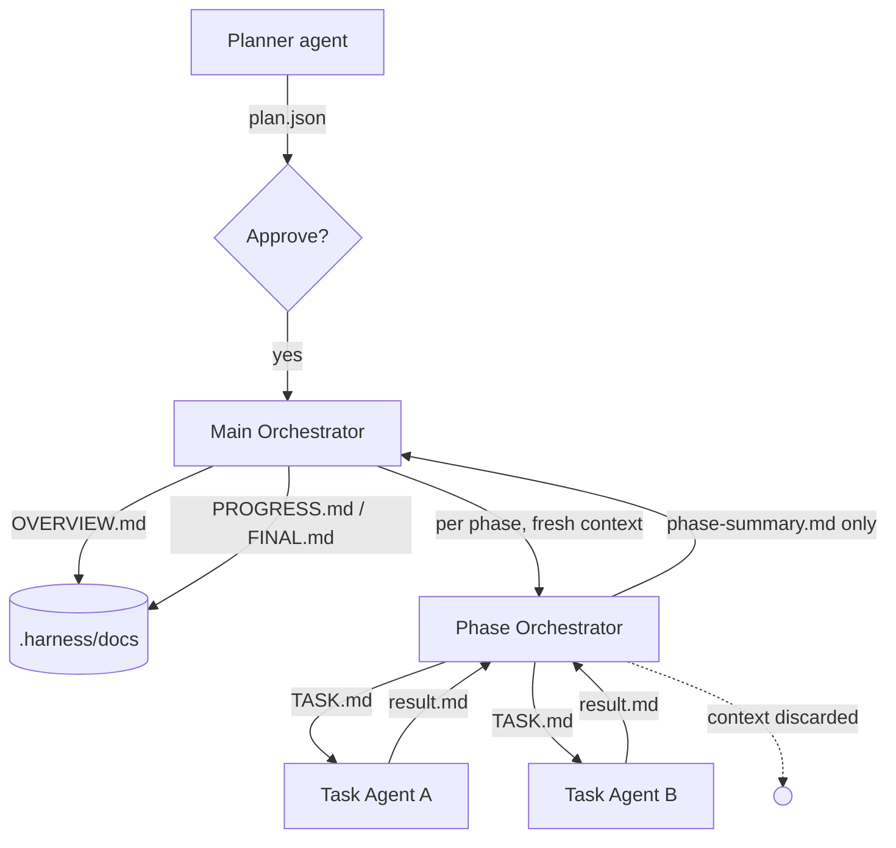

# llm-harness

A small, from-scratch **multi-LLM planning and orchestration harness** that drives
**other LLMs through their terminal CLIs** (Claude Code, Codex, Gemini CLI, aider,
`llm`, Ollama, …).

One LLM plans the work and breaks it into **phases → tasks → subtasks**. You
approve the plan. Then a **Main Orchestrator** drives execution: for each phase it
runs a fresh **Phase Orchestrator** that defines and dispatches **Task Agents**,
collects their work, summarizes the phase, and hands the summary back to Main —
which keeps the project docs up to date. **Every role's model/agent is choosable**,
per role *and* per task. It runs **inside your existing project**: agents execute
with the repo as their working directory, and all harness artifacts stay under
`.harness/`.



## Install

Needs Python ≥ 3.11. Install as a global tool so `harness` works in any project:

```bash
uv tool install --editable .       # or: uv tool install .
# (alternative) pipx install --editable .
```

This installs only `pydantic` + `pyyaml` — the default `cli` backend shells out to
LLM CLIs you already have, so no API SDKs are pulled in. For the optional API
backend: `uv tool install --with 'llm-harness[litellm]' .`

## Quick start (in an existing project)

```bash
cd my-existing-project
harness init                       # writes config + lists installed CLIs & their models
$EDITOR harness.config.yaml        # pick which CLI agent + model runs each role

harness plan --goal "Add retry with backoff to the HTTP client"
#   -> .harness/plan/plan.json + PLAN.md   (status: needs approval)

harness approve                    # the human gate
harness run                        # autonomous: agents work phase by phase
harness status                     # progress
```

`run` refuses until `approve`. Re-running resumes where it stopped.

### Planning inputs

```bash
harness plan --goal "..."          # from a one-line goal
harness plan --prd docs/PRD.md     # from a PRD / requirements file
harness plan --plan old-plan.json  # ingest an existing plan (JSON in our schema -> loaded as-is)
harness plan --plan ROADMAP.md     # free-form plan/PRD -> structured into our schema by the planner
```

### Mapping an existing project

Don't have a PRD? Point `harness map` at an unfamiliar (brownfield) codebase and it
scans the project into two docs under `.harness/docs/`: an `ARCHITECTURE.md` outline
(purpose, stack, module map, data flow, how to run) and a **reverse-engineered**
`PRD.md`. You confirm the PRD by reviewing/editing it, then feed it straight into
planning:

```bash
harness map                                  # scan -> .harness/docs/ARCHITECTURE.md + PRD.md
$EDITOR .harness/docs/PRD.md                 # the human confirmation: fix what's wrong
harness plan --prd .harness/docs/PRD.md      # the confirmed PRD drives the plan
harness approve && harness run
```

`map` builds a compact, provider-agnostic digest of the codebase (pruned file tree +
key file contents), so it works on every backend; with `provider: cli` the analyst
agent also reads the real files directly. Flags: `--target DIR` to scan a different
directory than the project root, `--model agent:model` to override the analyst (default
is the `main` role), and `--max-files` / `--max-bytes` to size the digest.

## Watching a run live

A run streams structured events to `.harness/runs/run.log`, and `plan.json` is the
live source of truth — so a viewer just polls the files and stays decoupled from
the engine. Two surfaces, both zero-dependency (stdlib only):

```bash
harness dashboard            # web UI at http://127.0.0.1:8787 (--open to launch a browser)
harness dashboard --host 0.0.0.0 --port 9000   # expose on your LAN
harness watch                # live dashboard right in the terminal
```

Run either in one terminal and `harness run` in another. They show overall
progress, **what each agent is doing right now** (task, `agent:model`, elapsed),
per-phase/task status, per-agent task counts + time, task durations (avg /
slowest), and a rolling event timeline. The web dashboard polls `GET /api/state`
(plain JSON) ~1s — point your own tooling at it too. No build step, no JS
framework, no API keys.

## How "terminal access to other LLMs" works

With `provider: cli`, each role is a **`{agent, model}` pair**: `agent` names an
entry in the `agents` map (a terminal command run in your project directory), and
`model` is substituted into that command's `{model}` token. So one agent command
serves many models, and you can mix CLIs *and* models freely per role — e.g. the
Main Orchestrator on Claude/Opus, Phase Orchestrators on Antigravity/Gemini, Task
Agents on OpenCode/Mimo. stdout is the response.

```yaml
provider: cli

models:
  planner: { agent: claude,      model: opus-4.8 }
  main:    { agent: claude,      model: opus-4.8 }
  phase:   { agent: antigravity, model: gemini-3.5-flash }
  task:    { agent: opencode,    model: mimo-v2.5-pro }   # different CLI + model per role/task

agents:
  claude:
    command: ["claude", "-p", "{prompt}", "--model", "{model}"]
  codex:
    command: ["codex", "exec", "--model", "{model}", "{prompt}"]
  antigravity:                                          # Antigravity CLI, binary `agy`
    command: ["agy", "-p", "{prompt}", "--model", "{model}"]
  opencode:
    command: ["opencode", "run", "--model", "{model}", "{prompt}"]
  ollama:
    command: ["ollama", "run", "{model}"]
    stdin: true        # pipe the prompt on stdin instead of via {prompt}
```

- `command` is an **argv list** (no shell, so no injection). Tokens may contain
  `{prompt}`, `{system}` and `{model}`. If `{system}` is absent, the system text
  is prepended to the prompt. With `stdin: true`, the prompt is piped on stdin.
- The flags above are illustrative — check each tool's own docs for the exact
  model-selection and non-interactive flags.
- A role value also accepts the shorthand string `agent:model` (e.g.
  `opencode:mimo-v2.5-pro`) or a bare `agent` (no model). CLI-specific extras like
  a reasoning level go in the model token or as a flag in the agent `command`.
- Per-phase / per-task `runner` objects live in `plan.json` and override the role
  defaults — edit them before `approve` to assign a different agent/model to a
  specific task:

  ```json
  "runner": { "agent": "opencode", "model": "mimo-v2.5-pro" }
  ```

### Seeing what you can assign

`harness init` (and `harness agents`) probes the configured CLIs and shows which
are installed and which models they offer, so you know what to put in `models:`:

```
$ harness agents
  [x] antigravity  (agy) — 8 model(s):
          Gemini 3.5 Flash (High)
          ...
  [x] claude  (claude) — models: n/a (no models_command)
  [x] opencode  (opencode) — 358 model(s):
          opencode-go/mimo-v2.5-pro
          ...
  [ ] cursor-agent  (cursor-agent) — not on PATH
```

An agent reports its models when its spec has an optional `models_command`:

```yaml
agents:
  opencode:
    command:        ["opencode", "run", "--model", "{model}", "{prompt}"]
    models_command: ["opencode", "models"]
```

These commands often hit the network/auth and can be slow, so each runs with a
bounded timeout (`--models-timeout` on init, `--timeout` on agents) and any
failure degrades to a note — it never blocks. Tools without an enumeration
command (claude, codex) just show `n/a`; pass the model to `--model` yourself.
`harness init --no-models` skips probing; `harness agents --json` is
machine-readable.

### Letting agents edit files

Task Agents run with your project as their working directory, so they can read and
modify real files — **if their CLI is allowed to**. Read-only/"print" modes only
return text. Configure the command with the flags your tool needs to apply edits,
e.g.:

```yaml
agents:
  claude:
    command: ["claude", "-p", "{prompt}", "--model", "{model}", "--permission-mode", "acceptEdits"]
  codex:
    command: ["codex", "exec", "--full-auto", "--model", "{model}", "{prompt}"]
```

(Check each tool's own docs for the exact non-interactive / auto-edit flags.)

## Other backends

```yaml
provider: litellm      # direct API calls, needs API keys
provider: scripted     # deterministic offline backend (demo/tests, no network)
```

With `provider: litellm` there is no terminal command, so a role's `model` is the
litellm model string (`openai/gpt-4o`, `anthropic/claude-3-5-sonnet-latest`,
`ollama/llama3`, …) and `agent` is ignored — e.g. `main: { model: openai/gpt-4o }`
(a bare string `openai/gpt-4o` works too). `litellm` requires the extra:
`pip install 'llm-harness[litellm]'`.

## Project layout produced by a run

```
my-project/
  harness.config.yaml              # provider + choosable {agent, model} per role
  .harness/
    plan/{BRIEF.md, PLAN.md, plan.json}     # plan.json = source-of-truth manifest
    phases/
      phase-01-<slug>/
        PHASE.md
        phase-summary.md           # Phase Orchestrator -> Main report
        tasks/task-01-<slug>/
          TASK.md                  # the task's work definition
          result.md                # the agent's completed work
          output/                  # artifacts the agent produced
    docs/{OVERVIEW.md, PROGRESS.md, FINAL.md}   # maintained by the Main Orchestrator
    runs/run.log                   # append-only structured JSONL events (feeds the dashboard)
```

Your own source files are never touched by the harness itself — only by the agents
you point at them.

## Design notes

- **Deterministic control flow, LLM cognition.** The engine (which agent runs
  when, dependency scheduling, file layout, status) is plain code. Each role uses
  its agent only for its own thinking.
- **Context cleaning is a hard invariant.** A Phase Orchestrator and its Task
  Agents are created per phase and dropped afterward; the Main Orchestrator only
  ever receives the phase *summary*, never task transcripts — so its context stays
  small across long runs. Enforced by the engine, covered by tests.
- **Dependency-aware execution.** Intra-phase `depends_on` forms a DAG; tasks run
  in dependency-ordered concurrent waves (`max_concurrency`); dependents receive
  upstream results as context. Cycles/unknown deps rejected at plan time.
- **Resumable.** Completed phases/tasks are skipped and their on-disk results
  reused as dependency context.

## Architecture (modules)

| module | responsibility |
|---|---|
| `harness/models.py`  | `AgentRef` + `Plan/Phase/Task/Subtask` models + graph validation |
| `harness/config.py`  | `harness.config.yaml`: provider, role `{agent, model}` runners, `agents` map |
| `harness/store.py`   | `.harness/` layout, manifest IO, structured event log, all writers |
| `harness/llm.py`     | `LLMProvider` protocol; `CLIProvider` / `LiteLLMProvider` / `ScriptedProvider`; JSON extraction |
| `harness/discovery.py` | detect installed CLIs + list their models (`init` / `agents`) |
| `harness/insights.py`  | `build_state` analytics over `plan.json` + events; terminal rendering |
| `harness/dashboard.py` | zero-dep web dashboard (stdlib `http.server` + `/api/state`) |
| `harness/scan.py`    | stdlib codebase digest (pruned tree + key files) for `map` |
| `harness/prompts.py` | per-role system prompts |
| `harness/agents.py`  | `Planner`, `Analyst`, `MainOrchestrator`, `PhaseOrchestrator`, `TaskAgent` |
| `harness/engine.py`  | dependency scheduler + run loop + context-clean boundary |
| `harness/cli.py`     | `init` / `agents` / `map` / `plan` / `approve` / `run` / `status` / `dashboard` / `watch` |

## Tests

```bash
pip install -e ".[dev]"
pytest -q
```

Covers model validation, the `.harness/` store, JSON extraction, the **CLIProvider
against real subprocesses** (`printf`/`cat`/`pwd`, cwd, missing-command and
nonzero-exit handling), existing-plan ingestion + non-pollution layout, and a full
offline engine run asserting the orchestration contract — dependency flow, wave
ordering, cross-phase isolation, the context-clean invariant, the approval gate,
and resumability.

[litellm]: https://github.com/BerriAI/litellm
