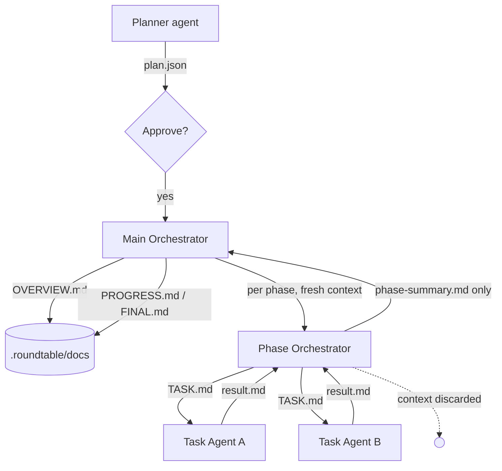

# Roundtable

**Roundtable** is a small, from-scratch **multi-LLM planning and orchestration tool**
that drives **other LLMs through their terminal CLIs** (Claude Code, Codex, Gemini CLI,
aider, `llm`, Ollama, …) — routing each part of the work to the model you choose, so no
single vendor's limit stalls the run.

One LLM plans the work and breaks it into **phases → tasks**. You
approve the plan. Then a **Main Orchestrator** drives execution: for each phase it
runs a fresh **Phase Orchestrator** that defines and dispatches **Task Agents**,
collects their work, summarizes the phase, and hands the summary back to Main —
which keeps the project docs up to date. **Every role's model/agent is choosable**,
per role *and* per task. It runs **inside your existing project**: agents execute
with the repo as their working directory, and all roundtable artifacts stay under
`.roundtable/`.



## Install

Needs Python ≥ 3.11. Install as a global tool so `roundtable` works in any project:

```bash
uv tool install --editable .       # or: uv tool install .
# (alternative) pipx install --editable .
```

This installs only `pydantic` + `pyyaml` — the default `cli` backend shells out to
LLM CLIs you already have, so no API SDKs are pulled in. For the optional API
backend: `uv tool install --with 'roundtable-cli[litellm]' .`

**Supported platforms:** macOS and Linux. On Windows, run it under WSL — the engine
uses POSIX process control (`SIGTERM` via `run.pid`) and, for `pty: true` agents, a
Unix pseudo-terminal, neither of which exists on native Windows. Whichever CLIs you
point it at (Claude Code, Codex, Gemini CLI, …) must also be installed and on your
`PATH`.

## Quick start (in an existing project)

```bash
cd my-existing-project
roundtable init                       # writes config + lists installed CLIs & their models
$EDITOR roundtable.config.yaml        # pick which CLI agent + model runs each role

roundtable plan --goal "Add retry with backoff to the HTTP client"
#   -> .roundtable/plan/plan.json + PLAN.md   (status: needs approval)

roundtable approve                    # the human gate
roundtable run                        # autonomous: agents work phase by phase
roundtable status                     # progress
```

`run` refuses until `approve`. Re-running resumes where it stopped.

## Recommended backend: pi

Roundtable works best with a **pi-family coding agent** — either upstream
[**pi**](https://github.com/earendil-works/pi) or the batteries-included fork
[**oh-my-pi (`omp`)**](https://github.com/can1357/oh-my-pi) (LSP/DAP/subagents). Both
speak ~40 model providers and share the same CLI contract. With `provider: pi`, **the
tool handles all LLM connectivity, auth and model routing** — roundtable just
orchestrates. Task agents run with the tool's file tools (they edit the repo); every
other role runs `--no-tools` as a pure completion. Because the tool reports usage, you
get **exact token counts and real dollar cost** per run (not estimates).

Pick the flavor with `pi.flavor` (`pi` or `omp`). They differ in only two details,
which roundtable handles for you: `omp` has no `--no-context-files`, and its task
agents get `--auto-approve` so they can edit autonomously.

If `pi` (or `omp`) is on your `PATH`, `roundtable init` scaffolds this backend for you:

```bash
npm install -g @earendil-works/pi-coding-agent    # install pi   (or: @oh-my-pi/pi-coding-agent for omp)
pi-ai login anthropic                             # connect an LLM (or export ANTHROPIC_API_KEY / OPENAI_API_KEY / …)
cd my-existing-project
roundtable init                                   # detects pi/omp -> writes the pi backend
roundtable plan --goal "Add retry with backoff to the HTTP client"
roundtable approve && roundtable run
```

The generated config routes a strong model to planning/orchestration and a cheap
one to the task work (edit freely; `pi --list-models` shows what you can assign):

```yaml
provider: pi
models:
  planner: { model: anthropic/claude-opus-4-1 }    # strong
  main:    { model: anthropic/claude-opus-4-1 }
  phase:   { model: anthropic/claude-sonnet-4-5 }
  task:    { model: anthropic/claude-haiku-4-5 }    # cheap/fast (or point at openrouter/opencode for free models)
pi:
  flavor: pi             # "pi" (upstream) or "omp" (oh-my-pi); omp uses the `omp` binary
  command: ["pi"]        # base binary; ["npx", "pi"] works too
  extra_args: []         # appended to every call, e.g. ["--thinking", "medium"]
  orchestrator_context_files: false   # (pi flavor) true -> orchestrator roles may read AGENTS.md/CLAUDE.md
```

To use **oh-my-pi** instead, set `flavor: omp` (and `command: ["omp"]`) — roundtable
adds `--auto-approve` to task agents and drops the pi-only `--no-context-files`.

**Don't have pi or omp?** You have two options — roundtable prints both at `init`:

1. **Install pi (or omp) and connect it to your LLMs** (recommended, above).
2. **Use what you already have:** `provider: cli` drives the terminal CLIs you've
   installed (claude, codex, gemini, …), or `provider: litellm` for direct API calls.
   These backends are unchanged; see below.

> Note: pi has no per-action permission gate and task agents share the project
> directory, so keep `max_concurrency: 1` (the default) unless you isolate tasks.

### Planning inputs

```bash
roundtable plan --goal "..."          # from a one-line goal
roundtable plan --prd docs/PRD.md     # from a PRD / requirements file
roundtable plan --plan old-plan.json  # ingest an existing plan (JSON in our schema -> loaded as-is)
roundtable plan --plan ROADMAP.md     # free-form plan/PRD -> structured into our schema by the planner
```

### Mapping an existing project

Don't have a PRD? Point `roundtable map` at an unfamiliar (brownfield) codebase and it
scans the project into two docs under `.roundtable/docs/`: an `ARCHITECTURE.md` outline
(purpose, stack, module map, data flow, how to run) and a **reverse-engineered**
`PRD.md`. You confirm the PRD by reviewing/editing it, then feed it straight into
planning:

```bash
roundtable map                                  # scan -> .roundtable/docs/ARCHITECTURE.md + PRD.md
$EDITOR .roundtable/docs/PRD.md                 # the human confirmation: fix what's wrong
roundtable plan --prd .roundtable/docs/PRD.md      # the confirmed PRD drives the plan
roundtable approve && roundtable run
```

`map` builds a compact, provider-agnostic digest of the codebase (pruned file tree +
key file contents), so it works on every backend; with `provider: cli` the analyst
agent also reads the real files directly. Flags: `--target DIR` to scan a different
directory than the project root, `--model agent:model` to override the analyst (default
is the `main` role), and `--max-files` / `--max-bytes` to size the digest.

## Watching a run live

`roundtable run` is **live by default**: it prints a web dashboard link up front and
renders the terminal `watch` view inline as it works — no second terminal needed.

```bash
roundtable run                  # runs + shows progress; dashboard link printed at the top
roundtable run --approve        # auto-approve the plan before running
roundtable run --no-watch       # run without the inline terminal view
roundtable run --no-dashboard   # run without serving the web dashboard
roundtable run --port 9000      # pin the run's dashboard port (default: a free port)
```

A run streams structured events to `.roundtable/runs/run.log`, and `plan.json` is the
live source of truth — so a viewer just polls the files and stays decoupled from
the engine. You can also open the standalone surfaces (e.g. to watch from another
machine), both zero-dependency (stdlib only):

```bash
roundtable dashboard            # web UI at http://127.0.0.1:8787 (--open to launch a browser)
roundtable dashboard --host 0.0.0.0 --port 9000   # expose on your LAN
roundtable watch                # live dashboard right in the terminal
roundtable stop                 # SIGTERM the in-progress run (via .roundtable/runs/run.pid)
```

These show overall
progress, **what each agent is doing right now** (task, `agent:model`, elapsed),
per-phase/task status, per-agent task counts + time, task durations (avg /
slowest), live token usage (estimated on the CLI backend), and a rolling event
timeline. The web dashboard is also **interactive**:
approve the plan, start/stop a run, and approve waiting HITL tasks right from the
page. No build step, no JS framework, no API keys.

## REST control API (`roundtable serve`)

The dashboard server doubles as a local JSON control API. `roundtable serve` starts
it headlessly and prints a
machine-readable JSON line first (`{"event": "serving", "url": ...}`) so tools
can parse the picked port (`--port 0` = a free one):

```bash
roundtable serve --project . --port 0
```

| endpoint | what it does |
|---|---|
| `GET /api/state` | live run state snapshot (same data as `watch`) |
| `GET /api/project` | project root, plan/config presence, run pid, waiting tasks |
| `GET /api/plan` · `PUT /api/plan` | read / save the plan (validated; editing resets approval) |
| `POST /api/plan/generate` · `GET` | spawn a detached `roundtable plan` (goal/prd/plan_file) · poll it |
| `POST /api/approve` | validate runners against the config, then approve |
| `POST /api/run` · `POST /api/stop` | spawn a detached run (guarded by `run.pid`) · SIGTERM it |
| `POST /api/resume` | approve a waiting HITL task `{"task": "p1-t2"}` |
| `POST /api/init` | scaffold `.roundtable/` + default config |
| `GET /api/config` · `PUT /api/config` | read / save `roundtable.config.yaml` (schema-validated) |
| `GET /api/agents` | probe installed CLIs + their models (`?timeout=s`) |
| `GET /api/usage` | provider usage snapshots (calls, tokens, duration) |

State-changing requests from browsers are limited to localhost/Tauri origins;
non-browser clients (e.g. curl) are unaffected.

With `provider: cli` a CLI returns only stdout, so token counts are **estimated**
from text length (~4 chars/token) and flagged with `"estimated": true` in the
usage snapshot; `provider: litellm` reports exact counts from the API.

## How "terminal access to other LLMs" works

With `provider: cli`, each role is a **`{agent, model}` pair**: `agent` names an
entry in the `agents` map (a terminal command run in your project directory), and
`model` is substituted into that command's `{model}` token. So one agent command
serves many models, and you can mix CLIs *and* models freely per role — e.g. the
Main Orchestrator on Claude/Opus, Phase Orchestrators on Antigravity/Gemini, Task
Agents on OpenCode/Mimo. stdout is the response.

```yaml
provider: cli

models:
  planner: { agent: claude,      model: opus-4.8 }
  main:    { agent: claude,      model: opus-4.8 }
  phase:   { agent: antigravity, model: gemini-3.5-flash }
  task:    { agent: opencode,    model: mimo-v2.5-pro }   # different CLI + model per role/task

agents:
  claude:
    command: ["claude", "-p", "{prompt}", "--model", "{model}"]
  codex:
    command: ["codex", "exec", "--model", "{model}", "{prompt}"]
  antigravity:                                          # Antigravity CLI, binary `agy`
    command: ["agy", "-p", "{prompt}", "--model", "{model}"]
  opencode:
    command: ["opencode", "run", "--model", "{model}", "{prompt}"]
  ollama:
    command: ["ollama", "run", "{model}"]
    stdin: true        # pipe the prompt on stdin instead of via {prompt}
```

- `command` is an **argv list** (no shell, so no injection). Tokens may contain
  `{prompt}`, `{system}` and `{model}`. If `{system}` is absent, the system text
  is prepended to the prompt. With `stdin: true`, the prompt is piped on stdin.
- `pty: true` allocates a real pseudo-terminal for the subprocess — use this when
  a CLI detects whether it's connected to a TTY and refuses to run (or switches to
  a degraded mode) without one.
- The flags above are illustrative — check each tool's own docs for the exact
  model-selection and non-interactive flags.
- A role value also accepts the shorthand string `agent:model` (e.g.
  `opencode:mimo-v2.5-pro`) or a bare `agent` (no model). CLI-specific extras like
  a reasoning level go in the model token or as a flag in the agent `command`.
- Per-phase / per-task `runner` objects live in `plan.json` and override the role
  defaults — edit them before `approve` to assign a different agent/model to a
  specific task:

  ```json
  "runner": { "agent": "opencode", "model": "mimo-v2.5-pro" }
  ```

Set the top-level `project_context` key (free text) to inject stack, conventions,
and working-directory notes into every task/phase prompt. Pass `-v`/`--verbose` to
any command for debug logging.

### Picking models per role (`roundtable models`)

Instead of hand-editing `models:`, run **`roundtable models`** to choose a model for
each role from the ones your backend is actually connected to — a two-step
**provider → model** prompt in the terminal that writes your picks back into the
config (leaving the rest of the file untouched). `roundtable init` offers the same
picker interactively when run in a TTY.

```bash
roundtable models              # interactive: pick planner / main / phase / task
roundtable models --list       # just print the connected models, grouped by provider
roundtable models --json       # machine-readable
roundtable models --verify     # after picking, send one tiny call to each model to confirm it works
```

It works for both backends: on `provider: pi` the list comes from the tool itself
(`omp models --json`, or `pi --list-models`) and "provider" is the model's provider
(`anthropic`, `opencode-go`, …); on `provider: cli` it comes from each agent's
`models_command` and "provider" is the agent (`claude`, `opencode`, …). Because the
list is the tool's *real* catalog, you can't fat-finger an unsupported id — and
`--verify` catches models that are listed but error at call time.

### Seeing what you can assign

`roundtable init` (and `roundtable agents`) probes the configured CLIs and shows which
are installed and which models they offer, so you know what to put in `models:`:

```
$ roundtable agents
  [x] antigravity  (agy) — 8 model(s):
          Gemini 3.5 Flash (High)
          ...
  [x] claude  (claude) — models: n/a (no models_command)
  [x] opencode  (opencode) — 358 model(s):
          opencode-go/mimo-v2.5-pro
          ...
  [ ] cursor-agent  (cursor-agent) — not on PATH
```

An agent reports its models when its spec has an optional `models_command`:

```yaml
agents:
  opencode:
    command:        ["opencode", "run", "--model", "{model}", "{prompt}"]
    models_command: ["opencode", "models"]
```

These commands often hit the network/auth and can be slow, so each runs with a
bounded timeout (`--models-timeout` on init, `--timeout` on agents) and any
failure degrades to a note — it never blocks. Tools without an enumeration
command (claude, codex) just show `n/a`; pass the model to `--model` yourself.
`roundtable init --no-models` skips probing; `roundtable agents --json` is
machine-readable.

### Letting agents edit files

Task Agents run with your project as their working directory, so they can read and
modify real files — **if their CLI is allowed to**. Read-only/"print" modes only
return text. Configure the command with the flags your tool needs to apply edits,
e.g.:

```yaml
agents:
  claude:
    command: ["claude", "-p", "{prompt}", "--model", "{model}", "--permission-mode", "acceptEdits"]
  codex:
    command: ["codex", "exec", "--full-auto", "--model", "{model}", "{prompt}"]
```

(Check each tool's own docs for the exact non-interactive / auto-edit flags.)

### Per-task and per-phase controls in plan.json

Two optional fields can be added to any task object in `plan.json` before running
`roundtable approve`:

```json
{
  "id": "p1-t2",
  "title": "Deploy to staging",
  "runner": { "agent": "claude", "model": "opus-4.8" },
  "validate_command": ["pytest", "tests/smoke/", "-q"],
  "requires_approval": true
}
```

- **`validate_command`** — an argv list that runs in the project root after the task
  agent finishes. A non-zero exit marks the task as failed (feeding into the retry
  loop and re-planning); exit 0 means success.
- **`requires_approval`** — when `true`, the run pauses before executing this task
  and waits for a human to type:
  ```bash
  roundtable resume --task p1-t2
  ```
  The engine prints the exact command. Other concurrent tasks in the same wave are
  unaffected (the semaphore slot is not held while waiting).

A **phase object** accepts `validate_command` too — the phase **completion
gate**. It runs in the project root after *all* of the phase's tasks succeed
(e.g. the phase's test suite); a non-zero exit marks the phase `failed` even
though its tasks are `done`. On re-run the completed tasks are reused and only
the gate re-runs, so fixing the project and re-running heals the phase.
Validation commands time out after `defaults.validate_timeout` (120s default).

## Other backends

```yaml
provider: pi           # recommended: drive the pi coding agent (see "Recommended backend: pi")
provider: cli          # reach other LLMs through their terminal CLIs (default without pi)
provider: litellm      # direct API calls, needs API keys
provider: scripted     # deterministic offline backend (demo/tests, no network)
```

With `provider: litellm` there is no terminal command, so a role's `model` is the
litellm model string (`openai/gpt-4o`, `anthropic/claude-3-5-sonnet-latest`,
`ollama/llama3`, …) and `agent` is ignored — e.g. `main: { model: openai/gpt-4o }`
(a bare string `openai/gpt-4o` works too). `litellm` requires the extra:
`pip install 'roundtable-cli[litellm]'`.

## Driving it from an MCP client

Expose the whole workflow to an MCP client (Claude Code, Claude Desktop) so an
agent can plan and run the roundtable as tool calls:

```bash
roundtable mcp        # stdio MCP server  (needs the extra: pip install 'roundtable-cli[mcp]')
```

Tools: `roundtable_init`, `roundtable_map`, `roundtable_plan`, `roundtable_approve`,
`roundtable_run` (non-blocking; guarded against duplicate launches via a `run.pid`),
`roundtable_stop`, `roundtable_status`, and `roundtable_usage` (token/cost tally); plus
read-only `roundtable://plan`, `roundtable://state`, and `roundtable://logs` resources.
Register it in Claude Code's `.claude/settings.json`:

```json
{ "mcpServers": { "roundtable": { "command": "roundtable-mcp" } } }
```

## Project layout produced by a run

```
my-project/
  roundtable.config.yaml              # provider + choosable {agent, model} per role
  .roundtable/
    plan/{BRIEF.md, PLAN.md, plan.json}     # plan.json = source-of-truth manifest
    phases/
      phase-01-<slug>/
        PHASE.md
        phase-summary.md           # Phase Orchestrator -> Main report
        tasks/task-01-<slug>/
          TASK.md                  # the task's work definition
          result.md                # the agent's completed work
          output/                  # artifacts the agent produced
    docs/{OVERVIEW.md, PROGRESS.md, FINAL.md}   # maintained by the Main Orchestrator
    runs/run.log                   # append-only structured JSONL events (feeds the dashboard)
```

Your own source files are never touched by the roundtable itself — only by the agents
you point at them.

## Design notes

- **Deterministic control flow, LLM cognition.** The engine (which agent runs
  when, dependency scheduling, file layout, status) is plain code. Each role uses
  its agent only for its own thinking.
- **Context cleaning is a hard invariant.** A Phase Orchestrator and its Task
  Agents are created per phase and dropped afterward; the Main Orchestrator only
  ever receives the phase *summary*, never task transcripts — so its context stays
  small across long runs. Enforced by the engine, covered by tests.
- **Dependency-aware execution.** `depends_on` forms a DAG; tasks run in
  dependency-ordered concurrent waves (`max_concurrency`) and dependents receive
  upstream results as context. A dep may reference a task in the **same phase or
  any earlier phase**; forward references, cycles, and unknown/duplicate ids are
  rejected at plan time. (Phases still run in order — cross-phase deps flow
  *results*, not cross-phase parallelism.)
- **Failure isolation.** A task that exhausts its retries — or fails its
  `validate_command` — is marked `failed`; every dependent (same or a later phase)
  is `skipped`; its phase and the overall run end `failed`, and no `FINAL.md` is
  written. A phase whose own `validate_command` fails is marked `failed` even when
  all its tasks completed. Provider exit codes are the failure signal, not output
  heuristics.
- **Resumable.** Completed phases/tasks are skipped and their on-disk results
  reused as dependency context; re-running retries failed/skipped work.
- **Dynamic re-planning.** After each dependency wave, if any task failed and
  tasks remain in the phase, the Phase Orchestrator is asked to adapt the
  remaining tasks' descriptions before they run — without touching the overall
  plan structure.

## Architecture (modules)

| module | responsibility |
|---|---|
| `roundtable/models.py`  | `AgentRef` + `Plan/Phase/Task` models + graph validation (intra- & cross-phase deps) |
| `roundtable/errors.py`  | `RoundtableError` (user-facing) + `TaskFailed` (per-task failure signal) |
| `roundtable/config.py`  | `roundtable.config.yaml`: provider, role `{agent, model}` runners, `agents` map, `project_context` |
| `roundtable/store.py`   | `.roundtable/` layout, manifest IO, structured event log, all writers |
| `roundtable/llm.py`     | `LLMProvider` protocol; `PiProvider` / `CLIProvider` / `LiteLLMProvider` / `ScriptedProvider`; JSON extraction; `RunStats` (tokens + cost) |
| `roundtable/discovery.py` | detect installed CLIs + list their models (`init` / `agents`) |
| `roundtable/modelpick.py` | list connected models + interactive per-role picker (`models` / `init`) |
| `roundtable/insights.py`  | `build_state` analytics over `plan.json` + events; terminal rendering |
| `roundtable/dashboard.py` | zero-dep web dashboard + REST control API (stdlib `http.server`) |
| `roundtable/runctl.py`   | `run.pid` protocol: detached run/plan launches, stop, HITL approve |
| `roundtable/scan.py`    | stdlib codebase digest (pruned tree + key files) for `map` |
| `roundtable/prompts.py` | per-role system prompts |
| `roundtable/agents.py`  | `Planner`, `Analyst`, `MainOrchestrator`, `PhaseOrchestrator`, `TaskAgent` |
| `roundtable/engine.py`  | dependency scheduler + run loop + context-clean boundary + failure/HITL handling |
| `roundtable/cli.py`     | `init` / `agents` / `models` / `map` / `plan` / `approve` / `run` / `resume` / `stop` / `status` / `dashboard` / `serve` / `watch` / `mcp` |
| `roundtable/mcp.py`     | MCP server (`roundtable mcp` / `roundtable-mcp`) exposing the workflow as tools + resources |

## Tests

```bash
pip install -e ".[dev]"
pytest -q
```

Covers model validation (incl. cross-phase deps, forward-ref/duplicate-id
rejection), the `.roundtable/` store, JSON extraction (objects, arrays, double-fenced
blocks), the **CLIProvider against real subprocesses** (streaming output, cwd,
missing-command and nonzero-exit handling), existing-plan ingestion + non-pollution
layout, and full offline engine runs asserting the orchestration contract —
dependency flow, wave ordering, cross-phase result flow, the context-clean
invariant, the approval gate (HITL `waiting` → `resume`), failure propagation
(failed task → skipped dependents → failed run), the phase completion gate
(phase `validate_command` failing/healing across re-runs), and resumability.

[litellm]: https://github.com/BerriAI/litellm
